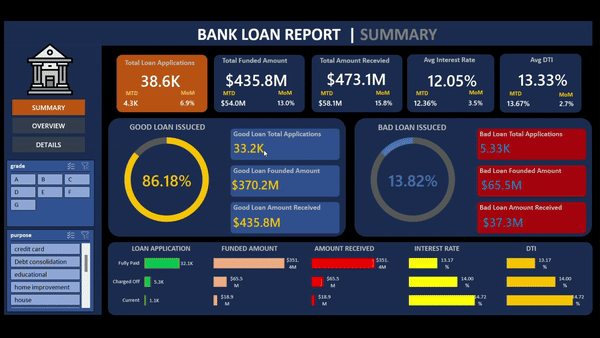
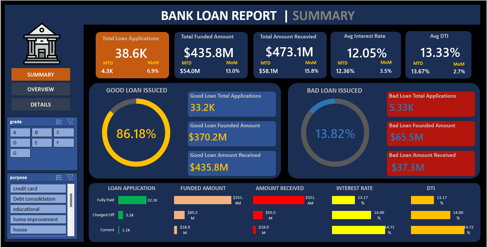
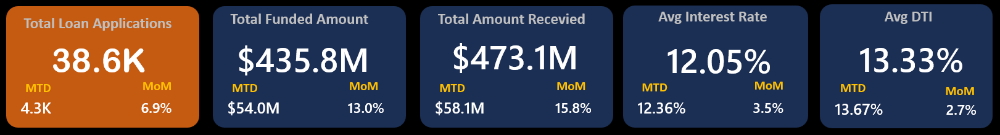
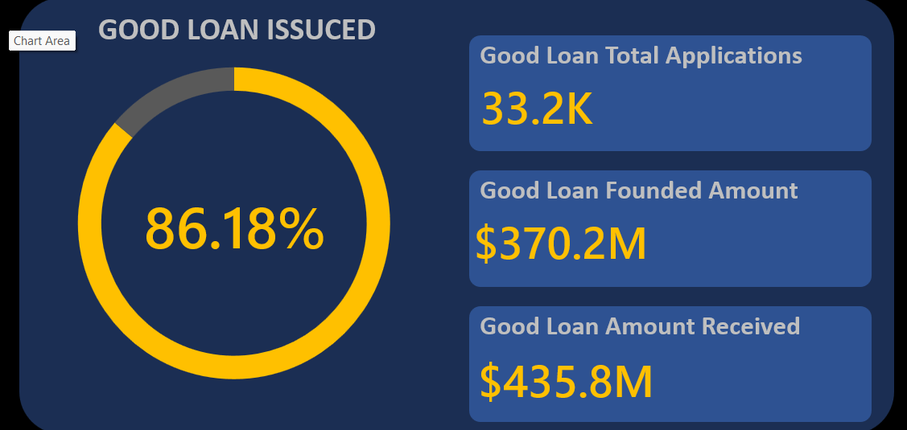
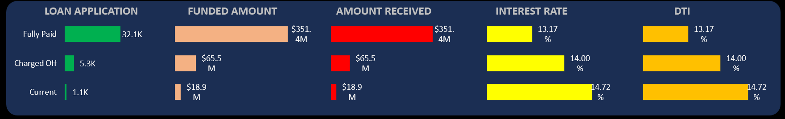
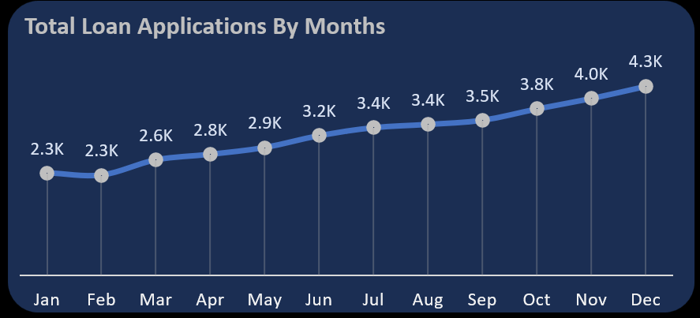
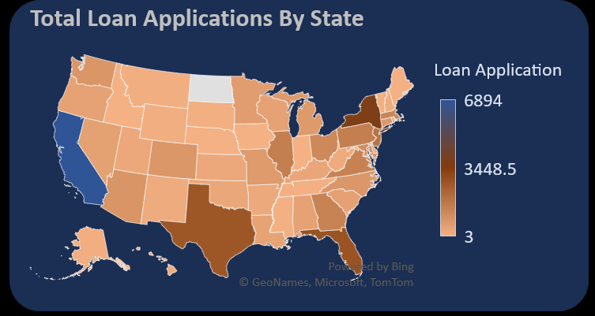
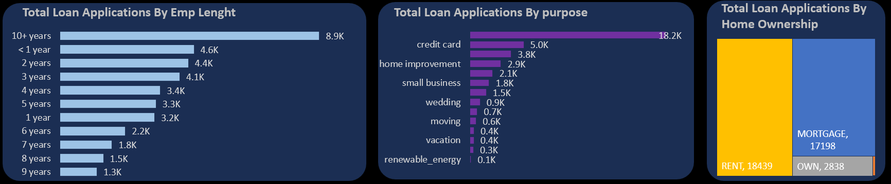

# 📊 Loan-Performance-Analysis in Excel

This project uses **Microsoft Excel** to analyze loan performance metrics and
provide insights into good and bad loans, borrower behavior, and lending trends.
The focus is on KPI tracking, portfolio monitoring, and dashboard-driven insights
commonly used in financial analytics.

---

## 🎥 Project Demo

---

## ✨ Key Features

📌 **Data Analysis** – Detailed examination of loan data to uncover performance trends  
📌 **Interactive Dashboards** – Excel dashboards with slicers for dynamic exploration  
📌 **KPI Reporting** – High-level metrics for decision-making  
📌 **Business Insights** – Identification of risk patterns and improvement areas  

---

## 🛠️ Tools Used

- **Microsoft Excel**
  - Data cleaning & preprocessing
  - KPI calculations using formulas
  - PivotTables & PivotCharts
  - Interactive dashboards with slicers

---

## 🚀 Project Workflow

✔️ Business understanding & KPI definition  
✔️ Data cleaning and preprocessing  
✔️ KPI calculation using Excel formulas  
✔️ Pivot table and chart creation  
✔️ Dashboard design and formatting  
✔️ Insight generation  

---

## 🧑‍💼 Business Objective

To monitor loan portfolio performance and borrower trends, enabling data-driven
decisions to optimize lending strategies and reduce default risk.

---

## 📈 Key Performance Indicators (KPIs)

### 1️⃣ Total Loan Applications
- Overall number of loan applications
- Month-to-Date (MTD) tracking
- Month-over-Month (MoM) trend analysis

### 2️⃣ Total Funded Amount
- Sum of all approved loan amounts
- MTD and MoM performance evaluation

### 3️⃣ Total Amount Received
- Total repayment amount collected from borrowers
- MTD and MoM comparison

### 4️⃣ Average Interest Rate
- Portfolio-level interest rate trends
- Monthly variation analysis

### 5️⃣ Average Debt-to-Income Ratio (DTI)
- Assessment of borrower financial health
- Risk indicator for potential defaults

---

## 📊 Dashboard Overview

---

## 📊 Summary Dashboard – Good Loan vs Bad Loan

### ✔️ Good Loan Metrics
- Good Loan Percentage
- Total Applications
- Total Funded Amount
- Total Amount Received

---

### ❌ Bad Loan Metrics
- Bad Loan Percentage
- Total Applications
- Total Funded Amount
- Total Amount Received

---

## 📋 Details Dashboard – Loan Status View

**Metrics Included**
- Total Applications
- Total Funded Amount
- Total Amount Received
- MTD Funded Amount
- MTD Received Amount
- Average Interest Rate
- Average DTI

---

## 📈 Analytical Charts & Insights

### 📅 Monthly Trends Analysis
Identifies seasonality patterns in loan applications and funding activity.

---

### 🌍 Regional Performance
Analyzes loan funding and repayment behavior across different states.

---

### 👥 Borrower Insights
Evaluates borrower characteristics based on employment length, loan purpose,
and homeownership status.

---

## 💡 Key Insights

### Loan Performance
- Good loans demonstrate higher repayment rates
- Bad loans exhibit higher financial risk indicators
- Seasonal variation impacts loan demand

### Regional Trends
- Certain regions contribute disproportionately to bad loans
- Highlights areas requiring stricter credit evaluation

### Borrower Behavior
- Employment length and homeownership strongly influence loan quality

---

## 📂 How to Use

1. Open `Loan_Performance_Analysis_Excel_Dashboard.xlsx`
2. Navigate through summary and detail dashboards
3. Use slicers to filter data dynamically and explore insights

---

## 📌 Learning Note

This project was completed as part of a structured learning process using
publicly available datasets and educational resources.  
The primary objective was to understand **financial KPIs, Excel-based analysis,
and dashboard storytelling**.

---

## ⚠️ Disclaimer

This repository is intended for **learning and portfolio demonstration purposes**.

---

## 🔗 Connect

- **Portfolio**: https://prajwalgopalpoojary.netlify.app  
- **LinkedIn**: https://www.linkedin.com/in/prajwalgopalpoojary  
